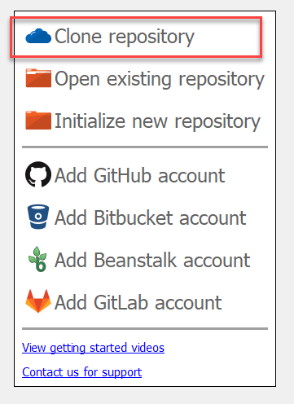
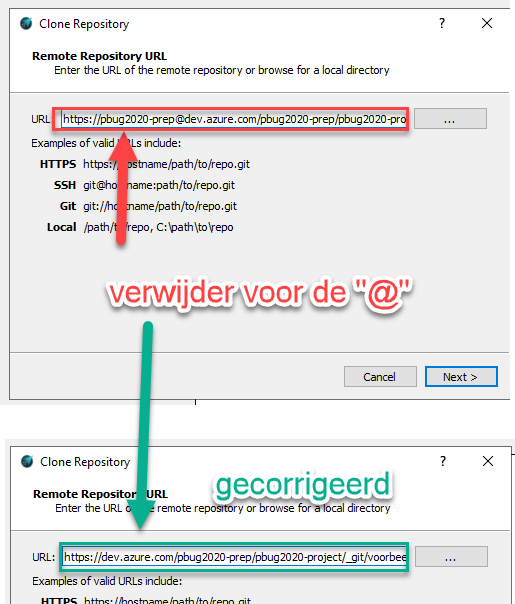
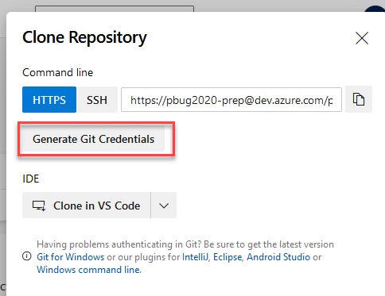

# Git lokaal gebruiken en installeren

## Installeren van Git tooling

Om Git lokaal te kunnen gebruiken in Windows, moeten we de Git executable installeren. Er zijn 1001 Git clients, en welke je gebruikt hangt sterk af van wat er in jouw organisatie ondersteund wordt, wat je gewend bent en hoe je Git wilt inzetten.

Omdat we vandaag niet zoveel op Git willen focussen, kiezen we voor een eenvoudige Git client: **GitAhead**.

Download en installeer GitAhead vanaf [https://gitahead.com/](https://gitahead.com/).

## Clone van repository

De map met spullen die "onder versiebeheer" staat, wordt in Git een *repository* genoemd. Om ermee aan de slag te gaan, maak je een *clone* van een repository. Je krijgt hiermee de volledige repository (inclusief geschiedenis) op jouw lokale omgeving.

Neem hiervoor de volgende stappen:

1. Open in Azure DevOps Repos de juiste repository (bijvoorbeeld `voorbeeld-pbi-deployment`)
2. Klik rechtsboven op **Clone**

3. Kopieer de URL. Laat het venster Clone Repository geopend!
4. Open GitAhead
5. Kies in het GitAhead scherm voor **Clone repository**

6. Plak de zojuist gekopieerde URL van Azure DevOps in het vakje "URL".
   * **Verwijder de gebruikersnaam voor de `@`**. 
   * De URL ziet er nu niet meer uit als `https://blabla@dev.azure.com/...`, maar `https://dev.azure.com/...`
   * (Wanneer je dit niet doet, blijft GitAhead continu om logingegevens vragen)
   * Klik **Next**

7. Pas, indien gewenst, de directory aan naar een plek die voor jou logisch is (dit moet een lege directory zijn!).
   * Laat de naam ongewijzigd!
   * Je zou bijvoorbeeld de repository op het bureaublad kunnen zetten, zodat je er snel bij kan gedurende de cursus
   * Je kunt de map later ergens anders heen verplaatsen, alles wat je nodig hebt voor Git zit in die map
   * Klik op **Clone** wanneer je de juiste map geselecteerd hebt

**GitAhead vraagt nu om je credentials**. Deze gaan we aanmaken binnen Azure DevOps:

8. Kies, binnen het geopende Azure DevOps "clone" scherm, voor **Generate Git credentials**:

9. Kopieer de gebruikersnaam en het wachtwoord, en plak deze in het credentials-venster van GitAhead. Klik **OK**:

